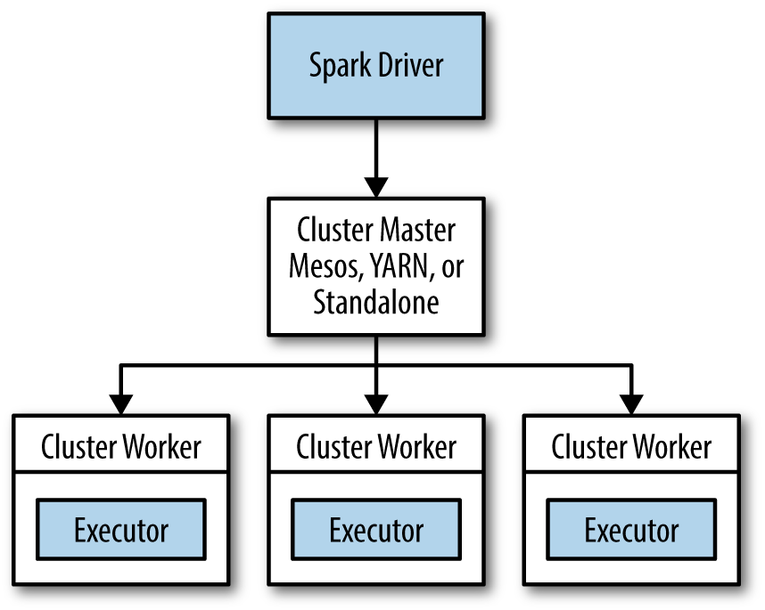

# Comparison of Data processing between traditional Mapreduce and Spark

| github: [:cloud:](https://github.com/cloudmesh-community/fa18-516-29/blob/master/project-paper/report.md)

## Introduction
The following section describes the performance comparison of a wordcount program between the Mapreduce and Spark engine on 
the 4 node cluster which we have installed:

## Motivation

We have completed the process of building up a 4 node cluster in Hadoop,Hive and Spark.Now,we can run wordcount mapreduce program
on files of different sizes and can check the completion time of the job when submitted in spark and mapreduce seperately.

## Running the jobs and comparing the output:

i. Run the below mapreduce jobs

yarn jar hadoop-mapreduce-examples-2.9.1.jar wordcount /user/externaltables/testdata1/testfile1 /user/logs1
yarn jar hadoop-mapreduce-examples-2.9.1.jar wordcount /user/externaltables/testdata2/testfile2 /user/logs2
yarn jar hadoop-mapreduce-examples-2.9.1.jar wordcount /user/externaltables/testdata3/testfile3 /user/logs3

ii. Run the below Spark jobs

spark-submit --deploy-mode client --class org.apache.spark.examples.JavaWordCount $SPARK_HOME/examples/jars/spark-examples_2.11-2.3.2.jar /user/externaltables/testdata1/testfile1
spark-submit --deploy-mode client --class org.apache.spark.examples.JavaWordCount $SPARK_HOME/examples/jars/spark-examples_2.11-2.3.2.jar /user/externaltables/testdata2/testfile2
spark-submit --deploy-mode client --class org.apache.spark.examples.JavaWordCount $SPARK_HOME/examples/jars/spark-examples_2.11-2.3.2.jar /user/externaltables/testdata3/testfile3

Benchmark Data:
 
 Filename          FileSize                        mapreduce completion time                               spark completion time

testfile1          724 MB                                          20 seconds                                               3 seconds

testfile2         1.58 GB                                          18 seconds                                               4 seconds

testfile3         6.48 GB                                          20 seconds                                               4 seconds

## Spark architecture :

{#fig:spark-Architecture}

Spark has a distributed computing model with one driver and multiple executors running on different nodes.

