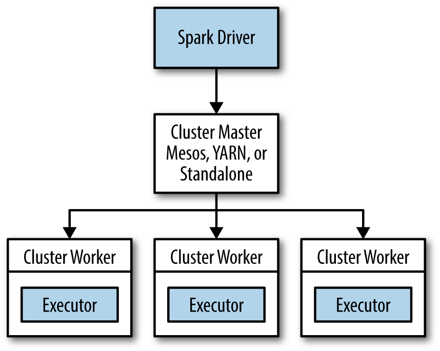

:o: The title should be 

*Automated ....*

# Installation and Configuration of fully-distributed multi-node Hadoop, Hive and Spark Cluster on Amazon EC2 instances

| Shilpa Singh
| shilsing@iu.edu
| Indiana University Bloomington
| hid: fa18-516-29
| github: [:cloud:](https://github.com/cloudmesh-community/fa18-516-29/tree/master/project-report/report.md)
| code: [:cloud:](https://github.com/cloudmesh-community/fa18-516-29/tree/master/project-code)

---

Keywords: Hadoop, Hive, Spark, AWS

---

:o: remove : in headings

:o: use proper indentation for verbatim

:o: use proper indentations for lists

:o: are images drawn by yourslef? if not they are plagarized as citations are missing

:o: lots of spaces missing after comma or dots

:o: please do read the epub on how to use markdown

:o: review grammare when using and the, sometimes they seem missing.

:o: you should not use putty but gitbash as this makes the project not only runable on windows but also linux via bash. As is the usability of the code is limited to windows which is something we try to avoid.

:o: you should use a local key generated with ssh-keygen as discussed in class.

:o: I do think you do not do the key management correctly. E.g. why using pem files and private/public keypair and mixing this while using it inconsistently. Please explain in detail so we learn from you why this is needed. Explain in particular why ... we quite do not yet get this.

:o: step vi. should be done with apython program. as well as the creation of the ssh config file, while fetching the vms via a shell script and doing this automatically.

:o: The creation of the  /etc/hosts shoudl be automatized and also its distribution

:o: the entire hadoop instaltion can be done with scripts or python programs.

:o: Hadoop is at version Release 3.2.0 available available, so your project seems outdated. Also security alerts are reported due to outdated software usage. Certainly it would be useful to use that. I know you have done this last semester, but we have made switches to new hadoop in a matetr of a day for our software, so this is nt that difficult. I will not deduct points for the older version. However, version 2.9.2 was available to you ... and as you should consider writing scipts, why not use the new version ... instead. E.g. your activity does not yet include the automation of the process which we focused on.

:o: due to the trivial markdown errors it is difficult to read the rest of the paper, I am sure you can see that. please correct.

:o: why not create a script for volume adjustment? Your documentation could be made much much simpler if you would use a scripted aproach. Maybe even create commands wioth docopts.

:o: the same we said about hadoop is valid for hive and spark

## Abstract

The goal of this project is to demonstrate the steps needed to set up a multi node Hadoop Cluster with Spark and Hive on Amazon EC2 instances from the scratch and do comparison between the traditional mapreduce and Distributed Computing through Spark. It details the Hadoop and Spark configurations required for a 8GB node Hadoop cluster for developmental and testing purpose.The objective is to do all the installations and configurations from the scratch.This process will be the same as doing the installation and set up on any 4 unix machines which have a static IP. 
We will also show how to integrate Spark as a compute engine in Hive and bypass mapreduce in Hive.
Lastly, we demostrate a sorting technique called "sort by value" where we sort data in large files based on a specified column by making use of map reduce framework without bringing all the data in memory of one node in a distributed environment.


## Introduction

Today,most of the Big data projects are leveraging Hadoop,Hive and Spark to foster an ETL environment in production and this project
is an approach to set up a multi node distributed environment in AWS EC2 instances and run some map-reduce jobs in this environment.
The project describes what are the minimum configurations required for a multi node Hadoop cluster set-up with Spark and Hive in AWS EC2 instances and how to establish a passwordless ssh connection between the instances.This is applicable for any unix/linux instances which can have a static IP and the same steps need to be followed for establishing a passwordless ssh connection and configuring the Hadoop and Spark config files.The recommended amount of memory for an instance is 8GB and atleast 20GB of physical disk space.

## Software versions

* Hadoop 2.9.1
* Hive 2.3.3
* Spark 2.3.2
* Java 8
	

## Instance configurations and passwordless ssh set up


**Motivation:** 
Before setting up a Hadoop cluster,it is important to set up connection between our client machine and the EC2 instances as 
well as passwordless ssh communication between the EC2 instances.Also,the IP of EC2 instances changes whenever we restart the servers.Since,we will need to stop and restart the machines only when we are using them,it is important to set up Elastic IPs for these instances,which do not change on restart else our passwordless ssh connection set up will not work.


**Cluster Planning:**
We will set up a 4 node Hadoop cluster with 1 node as master and 3 as slaves.Each instance is T2.large type and has 8 GB of memory
and initially 16GB of physical storage.This configuration is fine for doing the initial cluster set up and running some map reduce jobs for testing purpose,but definitely will not work for large datasets.For a substantial amount of data transfer,one should go for T2.Xlarge instances which have 16GB of memory and initially 32 GB of physical storage.The only downside is that it will be expensive to own 4 such large instances in EC2 for a developer.

{#fig:1 Namenode and 3 Datanodes in AWS EC2}


**Memory and Disk Requirements:**

In AWS,create 4 EC2 instances of type T2.large by following the guidelines given in EC2 manual of how to create an instance.The T2 large instance has 8GB of RAM.In order to launch containers in Hadoop and Spark on a yarn cluster,we found that 4GB of memory in the nodes is the mimimum required.If the memory is below this limit,the Application Master on the slave nodes will not start and the jobs will always be in ACCEPTED state.They will never get allocated to the Application master in slave nodes by the Resource Manager running in master node due to lack of resources.In this scenario also we have to specify the memory configurations in yarn-site.xml and mapreduce-site.xml for each process as Hadoop defaults do not work properly if the memory is less than 8GB.So, we chose to start with T2.large instances where the memory is 8GB.The physical storage of EC2 instances is 16GB and everything is mapped to the drive /dev/xvda.There are few challenges here as there are a lot of log files and local intermediate data which gets written in the datanodes when a mapreduce or spark job runs and this space also gets used up quickly.In our experiment,we found that atleast 11GB of physical storage was needed to start the containers which can get used up as more and more map reduce job runs.So,we chose to add more volume to T2.large instance in the physical storage whenever the space was getting full.This is feasible as EC2 instances have EBS storage and volume can be added on the fly.

**Configuring Elastic Ips for the instances:**

After allocating 4 instances,1 Namenode and 3 DataNodes of type T2.large,go to the Network and Security section of the EC2 Management console and allocate 4 new Elastic IPs from the IPv4 address pool.After this IP is allocated,map these IPs to the instances.This is important as the IPs in cloud are dynamic and change whenever we stop our machines.So,the set up will not work when we restart the instances again.Inorder to avoid this issue,we first allocate Elastic Ips to our instances.


{#fig:Elastic IP allocation for AWS EC2 instances}


**Configuring ssh connection between the client machine and EC2 instances:**

The first step after creating EC2 ubuntu instances is to arrange for login through putty.For this,get the client-keypair.pem file from AWS while creating instances.Use Putty keygen feature to generate .ppk file from the .pem file for an SSH connection.Add .ppk file in SSH Auth session of the all the nodes and save the session information in putty.Now,we can login in the instances with username ubuntu.


**Configuring passwordless ssh communication between the instances:**

The following are the steps to configure passwordless ssh between the master and slave nodes.

1. Create a config file with name config in `~/.ssh` folder with the below entries in all the 
instances including namenode and datanodes. Add the below entries in the file:

```
Host namenode
  HostName ec2-18-236-100-223.us-west-2.compute.amazonaws.com
  User ubuntu
  IdentityFile ~/.ssh/client-keypair.pem
Host datanode1
  HostName ec2-52-88-18-198.us-west-2.compute.amazonaws.com
  User ubuntu
  IdentityFile ~/.ssh/client-keypair.pem
Host datanode2
  HostName ec2-54-149-168-101.us-west-2.compute.amazonaws.com
  User ubuntu
  IdentityFile ~/.ssh/client-keypair.pem
Host datanode3
  HostName ec2-34-216-95-55.us-west-2.compute.amazonaws.com
  User ubuntu
  IdentityFile ~/.ssh/client-keypair.pem

```
	 
2. Copy the keyfile received from aws in the `~/.ssh` folder of all the instances from the local machine through winscp.
         
  ```
  ~/.ssh/client-keypair.pem

  ```
	   
3. Change the permissions of all the file in `~/.ssh` folder to 600 of all the servers. This is a requirement for 
    ssh to work correctly.
	
       
4. Go to the `~/.ssh` folder of namenode and run the following command.This will create 2 files sshkey_rsa.pub and sshkey_rsa in '~/.ssh' folder. 
          
```

ssh-keygen -f ~/.ssh/id_rsa -t rsa -P ""
 
```

5.Copy the contents of sshkey_rsa.pub to authorized_keys file in '~/.ssh' folder of namenode by the below command.
  This will create an entry for the user ubuntu in the authorized_keys file.
           
```

cat ~/.ssh/sshkey_rsa.pub >> ~/.ssh/authorized_keys

```
	   
6. Copy the file authorized_keys to all the datanodes instances in '~/.ssh' folder through winscp.From the datanode1 and namenode,do ssh to all the other datanodes.It will ask to enter the host names to known_hosts file. Confirm yes.
        
7. In the /etc/hosts file of all the instances add the following where the first IP is the Private IP and second is the Public DNS (IPv4) in EC2 management console.
        
   | 172.31.21.154 ec2-52-24-204-101.us-west-2.compute.amazonaws.com |
   | 172.31.16.132 ec2-52-38-172-19.us-west-2.compute.amazonaws.com  |
   | 172.31.19.37 ec2-52-42-185-237.us-west-2.compute.amazonaws.com  |
   | 172.31.30.216 ec2-52-89-22-141.us-west-2.compute.amazonaws.com  |
         
	
8. Change the hostname in all the instances to the public DNS name after login because by default they are the private IPs.
 This is very important because the instances know each other by their public DNS names.Repeat this on all the instances.
         
  ```
  
  sudo hostname ec2-52-24-204-101.us-west-2.compute.amazonaws.com.
  
  ```
	      
 The above steps complete the set up of passwordless ssh connection between all the instances.
   

   
## Hadoop Installation and Configuration

**Installation steps:**
 
 Below are the installation steps for Hadoop.Everything is done when logged in as user ubuntu.
   
 1.Before starting the installation,update all the servers as a good practice by the command:
   
  ```
  
 sudo apt-get update
  
  ```
   
 2. Install Java version8 in all the servers:
        
   ```

  sudo apt install openjdk-8-jdk
	
   ```
    
 3. Download and install Hadoop 2.9 on all the servers:
   
   ```
   
  wget http://apache.mirrors.tds.net/hadoop/common/hadoop-2.9.1/hadoop-2.9.1.tar.gz -P ~/hadoop_installation
      
   ```
    
 4. Uncompress the tar file in any directory called hadoop_home:
        
   ```
   
  tar zxvf ~/hadoop_installation/hadoop-* -C ~/hadoop_home
	
   ```
 
 5. set up the env variables in the .profile and .bashrc of all the servers:
 
```
export JAVA_HOME=/usr/lib/jvm/java-8-openjdk-amd64
export PATH=$PATH:$JAVA_HOME/bin
export HADOOP_HOME=/home/ubuntu/hadoop_home/hadoop-2.9.1
export PATH=$PATH:$HADOOP_HOME/bin
export HADOOP_CONF_DIR=/home/ubuntu/hadoop_home/hadoop-2.9.1/etc/hadoop

```
   
 6. Load profile in all the instances:
  
```
        
 ~/.profile
	
```
     
 7. Change the hadoop-env.sh in $HADOOP_HOME/etc/hadoop in all the instances to add the below line for JAVA_HOME:

```

export JAVA_HOME=/usr/lib/jvm/java-8-openjdk-amd64
	  
```
	  
**Hadoop configuration for a 8GB(Memory) node cluster:**
      
This is the configuration for T2.large instances.

```

filename          config key                          value in mb
         
mapred-site.xml   yarn.app.mapreduce.am.resource.mb    2048
mapred-site.xml   mapreduce.map.memory.mb              1024
mapred-site.xml   mapreduce.reduce.memory.mb           1024
yarn-site.xml     yarn.nodemanager.resource.memory-mb  6144
yarn-site.xml     yarn.scheduler.maximum-allocation-mb 6144
yarn-site.xml     yarn.scheduler.minimum-allocation-mb 1024

```

**Hadoop Namenode Format:**
After configuring the config files,format the namenode:
          
```
hdfs namenode -format  (Format resets the namenode and should only be done once in the lifetime of a cluster)
	  
```

	  
 **Start the Hadoop deamons by running the following commands:**
 
 Namenode:
	
```
$HADOOP_HOME/sbin/hadoop-daemon.sh --config $HADOOP_CONF_DIR --script hdfs start namenode
$HADOOP_HOME/sbin/yarn-daemon.sh --config $HADOOP_CONF_DIR start resourcemanager
$HADOOP_HOME/sbin/mr-jobhistory-daemon.sh --config $HADOOP_CONF_DIR start historyserver
	 
```
 The above 3 deamons will run on the Master node.
         
 DataNode1:
	
```
$HADOOP_HOME/sbin/hadoop-daemons.sh --config $HADOOP_CONF_DIR --script hdfs start datanode
	 
```
The datanode process just needs to be started in 1 slave machine DataNode1.This will start the process in another 
datanodes on its own through ssh connection.
         
DataNode1,DataNode2,DataNode3:
	
```
$HADOOP_HOME/sbin/yarn-daemon.sh --config $HADOOP_CONF_DIR start nodemanager
	 
```
The nodemanager process needs to be started in all the slave machines.


	 
**Creating directories in file system:**
        
 ``` 
 hadoop fs -mkdir /user/externaltables/testdata
 hadoop fs -copyFromLocal /home/ubuntu/datafiles/testfile /user/externaltables/testdata/testfile
 
 ```

**Run the map reduce job to test that the containers are getting launched properly in all the nodes:**
         
 ```
 yarn jar hadoop-mapreduce-examples-2.9.1.jar wordcount /user/externaltables/testdata/testfile /user/logs
 
 ```
	 
**Issues and resolution:**
       
 One very common issue which can come when the containers are launced on the nodes is that of lack of space in 
 the temp storage for the intermediate data which is generated by the mapreduce framework when the job runs.
 The error looks like:
     
   [INFO] Diagnostics: No space available in any of the local directories.
     
    1. To resolve this issue,find the filesystem to which hadoop.temp.dir is mapped to by thr below command:
         df /home/ubuntu/hadoop_home/hadoop-2.9.1/hadoop_tmp 
       This will show the below ext4 filesystem:
         /dev/xvda1
    
    2. df -h will show the space available in the above file system.If it is nearly full,then take more volume for the EC2
     instances by following the below steps:
       
    3. On the left side in Elastic Block Store,go to Volumes.Add the number of volumne required(another 8GB) to all the instances.
          All this will be mapped to the drive /dev/xvda.
          
    4. Login to putty of the machines and run lsblk.This will show something like below:
           xvda    202:0    0   16G  0 disk
            └─xvda1 202:1    0   8G  0 part /
            
    5. Increase the partition size of xvda1
            growpart /dev/xvda 1
           
    6. Resize the filesystem:
           resize2fs /dev/xvda1
           
    7. Do lsblk and confirm the partition size.It should be something like below:
           xvda    202:0    0   16G  0 disk
            └─xvda1 202:1    0   16G  0 part /
           
    8. Do df -h and confirm that the space allocated to the filesystem /dev/xvda1 is increased by 8GB.
       
    {#fig:Adding volume to EC2 instances}


## Hive Installation and Configuration in the multi-node Hadoop Cluster


   **Introduction:**
   
   The following section describes the installation and configuration of Hive on Hadoop cluster.
   
   **Motivation:**

 Hive provides a datawarehousing solution on hadoop and can be used to do computation on data which is of relational format.T
 his has a great use case in industries where most of the data are in relational format in legacy systems and are archived in disks.
 When there is a business use case to bring such data on a Big Data Platform and do some analytics on them,then Hive comes as the 
 first choice of platform.Hive can run on multiple execution engines and can be integrated with Spark so that the underlying 
 computation engine is Spark and not mapreduce.This increases the performance of hive queries greatly.Tez is another execution 
 engine of choice  with Hive.Both have an advantage over map reduce that they do the computation of data in memory by creating 
 immutable datasets and do not write the intermediate query outputs to the hdfs like mapreduce.This saves lot of Physical I/O 
 and makes the processing much faster.
 
  **Software:**
 
  Hive-2.3,Derby 10.4.2
  
  **Installation steps:**

  1. Download and Install Hive 2.3 which is compatible with Hadoop 2.9 only in the master machine.
      
     ```
     wget https://www-us.apache.org/dist/hive/hive-2.3.3/apache-hive-2.3.3-bin.tar.gz -P ~/hive_installation
      
     ```
   
  2. Uncompress the tar file in a directory $HIVE_HOME
      
      ```
      tar zxvf ~/hive_installation/apache-hive-* -C ~/hive_home
      
      ```
      
  3. Set up the env variables in all the .profile and .bashrc of all the servers
      
       ```
      export HIVE_HOME=/home/ubuntu/hive_home/apache-hive-2.3.3-bin
      export PATH=$PATH:$HIVE_HOME/bin
      export HIVE_CONF_DIR=/home/ubuntu/hive_home/apache-hive-2.3.3-bin/conf
      export CLASSPATH=$CLASSPATH:/home/ubuntu/hive_home/apache-hive-2.3.3-bin/lib/*:.
     
      ```
      
   4. Download and Install derby database for the metadatastore of hive
      
      ```
      wget http://archive.apache.org/dist/db/derby/db-derby-10.4.2.0/db-derby-10.4.2.0-bin.tar.gz
      tar zxvf db-derby-10.4.2.0-bin.tar.gz -C ~/derby_home
      
      ```
      
   5. Set up the env variables for Derby in .bashrc and .profile
      
      ```
      export DERBY_HOME=/home/ubuntu/derby_home/db-derby-10.4.2.0-bin
      export PATH=$PATH:$DERBY_HOME/bin
      export CLASSPATH=$CLASSPATH:$DERBY_HOME/lib/derby.jar:$DERBY_HOME/lib/derbytools.jar

      ```
      
   6. Load profile in all the servers

      ```
      ~/.profile
	
      ```
        
   7. Initialize the schema in derby in $HIVE_HOME folder.This will create a metastore_db directory which is the database
      directory and will be loaded in memory.
         
        ```
        cd $HIVE_HOME
        schematool -dbType derby -initSchema
	 
        ```
	

**Running Hive:**

  1. Create directories in HDFS for hive tables:
     
     ```
      hadoop fs -mkdir /user/externaltables/insurancedata
      hadoop fs -copyFromLocal insurance_datafile /user/externaltables/insurancedata/
	
     ```
        
  2. Start the hive terminal by typing command hive
         
      ```
       hive
	 
      ```
         
 3. Create an external table in hive pointing to the file in hdfs:
         
        ```
        create external table if not exists insurance_data_1(
         policyID int,
         statecode char(2),
         county string,
         eq_site_limit decimal,
         hu_site_limit decimal,
         fl_site_limit decimal,
         fr_site_limit decimal,
         tiv_2011 decimal,
         tiv_2012 decimal,
         eq_site_deductible decimal,
         hu_site_deductible decimal,
         fl_site_deductible decimal,
         fr_site_deductible decimal,
         point_latitude decimal,
         point_longitude decimal,
         line string,
         construction string,
         point_granularity int)
         comment 'Test data about insurance data'
         row format delimited
         fields terminated by ','
         stored as textfile
         location '/user/externaltables/insurancedata/';
	 
	```
 4. Run a query in hive to count the number of policies:
        
	  ```
          select count(policyID) from insurance_data_1;
	  
	  ```

  ## Spark Installation and Configuration in a Multi node Hadoop Cluster


   **Introduction:**
     The following section describes the installation and configuration of Spark on Hadoop cluster.


   **Motivation:**
    Spark by design is a Distributed Computing Engine and creates an immutable resilient dataset RDD in memory on top of the data 
    in the underlying file system.These RDDs are partitioned and loaded into the memory of all the nodes in the cluster.
    The computation from one stage to another happens in memory itself by streaming data to subsequent RDDs without the need 
    of writing the intermediate data to the file system as in the case of traditional map reduce where the output of each map 
    phase is written to HDFS resulting in lot of Physical I/O.Spark minimizes this Physical I/O and does the entire computation 
    in memory making the processing much faster.Almost all the contemporary Big Data platforms today are using Hadoop as a storage 
    and Spark as a Compute Engine.Spark integrates very well with Hive through HiveContext and Spark SQL is used to write 
    Procedural SQL code on data described in relational format in Hive by importing them in Spark Dataframes which is an 
    abstraction over RDD.
	
   **Software:**
     Spark-2.3.2
	
   **Installation steps:**

  1. Download and install spark 2.3.2.
 
     ```
     wget https://www-eu.apache.org/dist/spark/spark-2.3.2/spark-2.3.2-bin-hadoop2.7.tgz -P ~/spark_installation
	
     ```
    
  2. Untar the zip file in SPARK_HOME

     ```
     tar zxvf spark-2.3.2-bin-hadoop2.7.tgz -C ~/spark_home
     ```
     
  3. set the env variables in .profile and .bashrc

     ```
      export SPARK_HOME=/home/ubuntu/spark_home/spark-2.3.2-bin-hadoop2.7
      export PATH=$PATH:$SPARK_HOME/bin
      export SPARK_CONF_DIR=/home/ubuntu/spark_home/spark-2.3.2-bin-hadoop2.7/conf
	
     ```
	 
   **Spark configuration in spark-defaults.conf for a 8GB(memory) node**
   
       ```
      spark.master                         yarn
      spark.executor.memory                4g
      spark.eventLog.enabled               false
      spark.serializer                     org.apache.spark.serializer.KryoSerializer
      spark.yarn.executor.memoryOverhead   750m
      spark.yarn.submit.file.replication    1
      spark.yarn.stagingDir                /home/ubuntu/yarnstage
      spark.yarn.historyServer.address     ${hadoopconf-yarn.resourcemanager.hostname}:18080
      spark.dynamicAllocation.enabled      false
	
  We have to keep the executor memory + overhead less than the one allocated to the yarn.scheduler.maximum-allocation-mb


   **Running Spark:**
    
 Test that spark is getting launched through yarn by running the spark wordcount job in client mode.
   
   ```
   spark-submit --deploy-mode client --class org.apache.spark.examples.JavaWordCount 
   $SPARK_HOME/examples/jars/spark-examples_2.11-2.3.2.jar /user/externaltables/testdata/testfile
   
   ```
   
   ## Integration of Hive with Spark

  **Introduction:**
  The following section describes how to integrate Hive with Spark.

  **Motivation:**
   Hive can run on multiple execution engines and can be integrated with Spark so that the underlying computation 
   engine is Spark and not Mapreduce.This increases the performance of hive queries greatly as Spark does not write 
   the intermediate data to the local filesystem and does the computation in memory by creating immutable partitioned 
   datasets RDDS and streaming data from one RDD to another without the need of writing the intermediate results to HDFS.
   This saves lot of Physical I/O and makes the query processing much faster.

  **Software:**
 	Hive 2.3, Spark 2.3.2
	
  **Integration of Hive and Spark:**
  
   1. Link the following Spark jars to Hive:
  
      ```
      ln -s /home/ubuntu/spark_home/spark-2.3.2-bin-hadoop2.7/jars/spark-network-common_2.11-2.3.2.jar 
      /home/ubuntu/hive_home/apache-hive-2.3.3-bin/lib/spark-network-common_2.11-2.3.2.jar
      
      ln -s /home/ubuntu/spark_home/spark-2.3.2-bin-hadoop2.7/jars/spark-core_2.11-2.3.2.jar 
      /home/ubuntu/hive_home/apache-hive-2.3.3-bin/lib/spark-core_2.11-2.3.2.jar

      ln -s /home/ubuntu/spark_home/spark-2.3.2-bin-hadoop2.7/jars/scala-library-2.11.8.jar 
      /home/ubuntu/hive_home/apache-hive-2.3.3-bin/lib/scala-library-2.11.8.jar
      
    
  2. Do the following configurations in hive-site.xml(For a 8GB memory node):
       
       ```
        hive.execution.engine                 spark
        spark.master                          yarn-cluster
        spark.eventLog.enabled                TRUE
        spark.eventLog.dir                    file:///home/ubuntu/hive_home/apache-hive-2.3.3-bin/spark_logs
        spark.executor.memory                 4g
        spark.yarn.executor.memoryOverhead    750	
        spark.serializer                      org.apache.spark.serializer.KryoSerializer
      
      ```
       
 3. Configure yarn-site.xml with the Fair Scheduler:
      ```
        yarn.resourcemanager.scheduler.class=org.apache.hadoop.yarn.server.resourcemanager.scheduler.fair.FairScheduler
       ```
         
        


 **Running Hive on Spark:**	  
	  
   1. Create directories in HDFS for storing Hive data as an external table
      
      ```
      hadoop fs -mkdir /user/externaltables/insurancedata
      hadoop fs -copyFromLocal insurance_datafile /user/externaltables/insurancedata/
      
      ```
        
   2. Start the hive terminal by typing command Hive
      
       ```
       hive
       
       ```
         
   3. Create an External table in Hive pointing to the file in HDFS:
         
       ```
         create external table if not exists insurance_data_1(
         policyID int,
         statecode char(2),
         county string,
         eq_site_limit decimal,
         hu_site_limit decimal,
         fl_site_limit decimal,
         fr_site_limit decimal,
         tiv_2011 decimal,
         tiv_2012 decimal,
         eq_site_deductible decimal,
         hu_site_deductible decimal,
         fl_site_deductible decimal,
         fr_site_deductible decimal,
         point_latitude decimal,
         point_longitude decimal,
         line string,
         construction string,
         point_granularity int)
         comment 'Test data about insurance data'
         row format delimited
         fields terminated by ','
         stored as textfile
         location '/user/externaltables/insurancedata/';
	 
         
   4. Run a query in debug mode to count the number of policies:
       
       ```
        hive --hiveconf hive.root.logger=DEBUG,console -e "select count(policyID) from insurance_data_1"
      
	  
   5. We can see the spark jobs being launched on the web ui:

      http://ec2-52-24-204-101.us-west-2.compute.amazonaws.com:4040


   ## Comparison of Data processing between traditional Mapreduce and Spark
   
   **Introduction:**
    The following section describes the performance comparison of a wordcount program between the Mapreduce 
    and Spark engine on the 4 node cluster which we have installed:

   **Motivation:**
   We have completed the process of building up a 4 node cluster in Hadoop,Hive and Spark.Now,we can run wordcount 
   mapreduce program on files of different sizes and can check the completion time of the job when submitted in spark 
   and mapreduce seperately.

   **Running the jobs and comparing the output:**

   1. Run the below mapreduce jobs

   ```
   yarn jar hadoop-mapreduce-examples-2.9.1.jar wordcount /user/externaltables/testdata1/testfile1 /user/logs1
   yarn jar hadoop-mapreduce-examples-2.9.1.jar wordcount /user/externaltables/testdata2/testfile2 /user/logs2
   yarn jar hadoop-mapreduce-examples-2.9.1.jar wordcount /user/externaltables/testdata3/testfile3 /user/logs3
   ```

2. Run the below Spark jobs

  ```
  spark-submit --deploy-mode client --class org.apache.spark.examples.JavaWordCount 
  $SPARK_HOME/examples/jars/spark-examples_2.11-2.3.2.jar /user/externaltables/testdata1/testfile1
 
  spark-submit --deploy-mode client --class org.apache.spark.examples.JavaWordCount 
  $SPARK_HOME/examples/jars/spark-examples_2.11-2.3.2.jar /user/externaltables/testdata2/testfile2
  
  spark-submit --deploy-mode client --class org.apache.spark.examples.JavaWordCount
  $SPARK_HOME/examples/jars/spark-examples_2.11-2.3.2.jar /user/externaltables/testdata3/testfile3

  ```

 3.Benchmark Data:
 
  |  Filename    |      FileSize  |   Mapreduce completion time  |  spark completion time |
  | ------------ | -------------- | ---------------------------- | ---------------------- |
  |              |                |                              |                        |
  |  testfile1   |      724 MB    |    20 seconds                |   3 seconds            |                      
  |              |                |                              |                        |
  |  testfile2   |     1.58 GB    |    18 seconds                |    4 seconds           |                          
  |              |                |                              |                        |
  |  testfile3   |     6.48 GB    |    20 seconds                |    4 seconds           |                         


### Spark Architecture :

{#fig:S-Architecture}

Spark has a Distributed computing model with one driver and multiple executors running on different nodes.

### Spark Processing through DataFrames(An abstraction over RDDs)

{#fig:Spark-Dataframes processing}

Spark does the in-memory processing through Dataframes which are schema defined RDDs loaded in memory of each node in the cluster
over the file present in HDFS.The computation from one stage to another(map to map/reduce) happens by streaming data from one
dataframe to the subsequent one.This is an in-memory operation and does not require the intermediate data to be written to the 
local file system,hence saving a lot of Physical I/O and making processing much faster than traditional Mapreduce where
the output of each intermediate stage is written to HDFS and is read by the subsequent stage from HDFS.This leads to a lot 
of disk operations thus slowing down the processing.In our benchmarking,we can easily see the large difference in time of completion
of a Mapreduce job and a Spark job.This difference gets predominant as the file size increases, thus making mapreduce inefficient
for processing large volumes when timing is an important factor and Spark comes as the obvious choice for Distributed Computation with Hadoop as the Distributed Storage.

## Secondary Sort Design Pattern in Spark and Mapreduce

### Introduction:

The MapReduce framework automatically sorts the keys generated by mappers. This means that, before starting reducers, all intermediate key-value pairs generated by mappers are sorted by key (and not by value).In scenarios where we also want to sort the values in the reducer for example as in time series data,secondary sort design pattern is very helpful.

### Motivation:

For a large dataset,if we want to sort the values in the reducer for example [Key : list {Value1,Value2,Value3....}] where values should
also be sorted,then we have 2 options:

:o: use proper markdown

1.To bring all the data for a key in an array in a single reducer then sort them.This may not scale if there are too many values
for a single key.

2.The second option is to leverage the sorting ability of map reduce framework where the data sent to the reducer is already sorted
by the key of the data in key:value pair.Here,the approach is to introduce the value by which it is to be sorted in the key of the
data as a composite key {natural key,value to be sorted} and then the framework will do the sorting on multiple nodes without shuffling
and bringing the entire data in one node.

{#fig:Spark-Secondary Implementation Logic}

### Implementation in MapReduce:

For example,we have the data:
 
:o: use proper markdown
 
 2012, 50
 2012, 45
 2012, 35
 2012, 10
 2001, 46
 2001, 47
 2001, 48
 2001, 40
 2005, 20
 2005, 01 

We want to achieve the following output,where it is sorted by key(1st column) as well as by value(2nd column):

:o: use proper markdown


2001    40
2001    46
2001    47
2001    48
2005    1
2005    20
2012    10
2012    35
2012    45
2012    50

Then using mapreduce framework we have to do the following:

:o: use proper markdown

1.Tell the framework how to sort the reducer keys.This done by making a composite key which consists of both natural key and the
actula value and attaching a compartor to it which will compare the 2 composite keys based on natual key and actual value and
sort the data accordingly for sending it to the reducer.This sorting is done before the reduce phase.

:o: use proper markdown

2.Secondly, we have to introduce a custom partitioner which will partition the data and send it to the reducers based on actual
natural keys.Since we have modified the natural key to include the value column as well,we have to specify in custom partitioner
to only include natural key while partitioning the data.

:o: use proper markdown

3.Lastly,once the data reaches the reducer we have to tell the reduce method to group the data by the actual natural key and
  not by the entire composite key.
  
  The above steps will ensure that the data is sorted by the natural key and then by the desired value column for sorting.
  
## Conclusion:

:o: use proper markdown

  As part of this project,we were able to set up a fully distributed Hadoop cluster with Spark and Hive and able to do comparison
  between Mapreduce and Spark job on files of different sizes.Also,we explored a design pattern called "Secondary Sort" to sort a file based on a column specified as a value column.This design pattern can be used to sort large files based on a required column by leveraging the mapreduce framework and does not require all the data needed for sorting to come to one particular node.
  

## Acknowledgement:

:o: use proper markdown

  The author would like to thank Dr. Gregor von Laszewski for his support and suggestions to write this paper.
   
## References:

:o: use proper markdown

  Seconadry Sort :https://github.com/mahmoudparsian/data-algorithms-book
  
  Hadoop installation and configuration: https://hadoop.apache.org/docs/current/hadoop-project-dist/hadoop-common/ClusterSetup.html
  
  Hive installation and configuration on Hadoop: https://cwiki.apache.org/confluence/display/Hive/GettingStarted
  
  Spark installation and configuration on Hadoop: https://spark.apache.org/docs/latest/running-on-yarn.html
  
  
  
  

